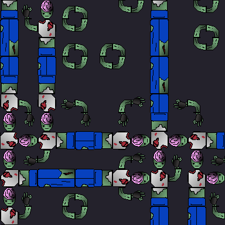

# MonsterGenerator
Using WaveFunction Collapse to make monstrous bodies!

This is a set of rules used with [Maxim Gumin's WFC in C#.](https://github.com/math-fehr/fast-wfc) It uses the Simple Tiled Model with custom tilesets.

## Outputs
Produces a NxN image made of 32x32px tiles.

We have provided two tilesets - zombie and centipede.

## How to use
1. Open samples.xml
    1. Edit parameters: which monsters to output, width and height of output in tiles
2. In root directory, enter command: dotnet run WaveFunctionCollapse.csproj
3. After running, output will appear in the root directory.

## Progress shots
Here are some images showing the process of making the project.
We had some issues with arms:

## Tiles
To make your own tilesets, you need the following tiles in the .png format.
Tiles must be oriented the same way as ours.
1. Head

2. Chest

3. Abs

4. Legs

5. Feet

6. Arm

7. Hand

8. Empty

